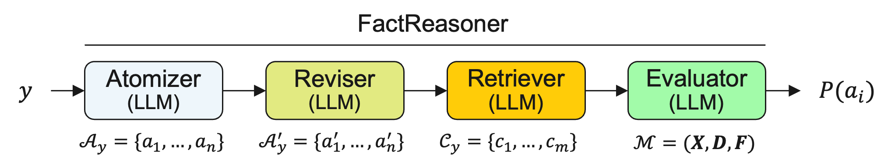

[](https://opensource.org/licenses/Apache-2.0)
[](https://www.python.org/downloads/release/python-3120/)


# `FactReasoner`: A Probabilistic Approach to Long-Form Factuality for Large Language Models

Large language models (LLMs) have demonstrated vast capabilities on generative tasks in recent years, yet they struggle with guaranteeing the factual correctness of the generated content. This makes these models unreliable in realistic situations where factually accurate responses are expected. In this paper, we propose `FactReasoner`, a new factuality assessor that relies on probabilistic reasoning to assess the factuality of a long-form generated response. Specifically, `FactReasoner` decomposes the response into atomic units, retrieves relevant contexts for them from an external knowledge source, and constructs a joint probability distribution over the atoms and contexts using probabilistic encodings of the logical relationships (entailment, contradiction) between the textual utterances corresponding to the atoms and contexts. `FactReasoner` then computes the posterior probability of whether atomic units in the response are supported by the retrieved contexts.


Assessing the factuality of long form text generations is a challenging problem because these kinds of generations may contain a large number of informative statements and validating each piece of information against one or more reliable sources may be time-consuming, costly and often prone to errors.

Formally, let $y$ be the long form text generated by a large language model $\mathcal{L}$ in response to a query $x$. Following prior work, we assume that $y$ consists of $n$ *atomic units* (or *atoms*) that can be either true or false, denoted by $\mathcal{A}_y = \{a_1, a_2, \ldots a_n\}$. An atomic unit $a_i \in \mathcal{A}_y$ is defined as a short sentence conveying one piece of information. Furthermore, given an external knowledge source $\mathcal{C}$ (e.g., Wikipedia, the Web, or a collection of documents embedded into a vector database), we say that an atomic unit $a_i\in \mathcal{A}_y$ is *supported* by $\mathcal{C}$ if there exists at least one piece of information in $\mathcal{C}$ (e.g., a passage) called a *context* that undebatably supports $a_i$. Otherwise, we say that the atomic unit is *not supported*.

Therefore, the *factual precision* $Pr(y)$ of the response $y$ with respect to a knowledge source $\mathcal{C}$ is defined as:
$$
Pr(y) = \frac{S(y)}{|\mathcal{A}_y|}
$$

where $S(y) = \sum_{i=1}^{n} \mathbb{I}[a_i \textrm{ is supported by } \mathcal{C}]$ is the number of supported atomic units.

Similarly, the notion of *factual recall* (i.e., measuring recall is quite challenging because it is almost impossible to come up with a definite set of atomic units that should be included in a long form response) up to the $K$-th supported atomic unit} denoted by $R_K(y)$ can be defined as follows:
$$
R_K(y) = \min(\frac{S(y)}{K}, 1)
$$

Combining the factual precision and recall at $K$ yields an $F_1$ measure for factuality denoted $F1@K$ as follows:
$$
    F_1@K(y) = \frac{2\cdot Pr(y) \cdot R_K(y)}{Pr(y) + R_K(y)} \textrm{, if } S(y) > 0
$$

Intuitively, $F_1@K(y)$ measures the long-form factuality of a model response $y$ given the numbers of supported and not-supported atomic units in $y$. The parameter $K$ indicates the number of supported atomic units required for a response to achieve full recall. Note that $F_1@K(y) = 0$, if $S(y) = 0$.

`FactReasoner` computes the posterior probabilities $P(a_i)$ and $P(\neg a_i) for each atom. Therefore, in addition to the factual precision $Pr(y)$ and $F_1@K$ measures, we define a new *entropy*-based factuality measure called $\mathcal{E}(y)$ that leverages the posterior probabilities of response $y$'s atoms:
$$
    \mathcal{E} = \frac{1}{n} \sum_{i=1}^{n} -P(a_i) \cdot \log P(a_i)
$$
where $n$ is the number of atomic units in $y$.

Clearly, if all atoms in $\mathcal{A}_y$ have posterior probability $P(a_i) = 0.5$, there is virtually no external information to support or contradict the atoms (we refer to these atoms as *undecided atoms*) then $\mathcal{E}(y) = 0.150515$. On the other hand, if all atoms are true with absolute certainty ($P(a_i) = 1$), then $\mathcal{E}(y) = 0$ and if all atoms are false with absolute certainty then $\mathcal{E}(y) = \infty$. Therefore, when $\mathcal{E}(y)$ is closer to $0$ the response is more truthful.


## The FactReasoner Pipeline



The `FactReasoner` pipeline for long-form factuality assessment is shown above and consists of four main stages called `Atomizer`, `Reviser`, `Retriever` and `Evaluator`, respectively. It takes as input a response $y$ and outputs the marginal posterior probabilities $P(a_i)$ of $y$'s atomic units together with the factuality measures described earlier, such as $Pr(y)$, $F_1@K(y)$ and $\mathcal{E}(y)$, respectively.

The `Atomizer` prompts an LLM to decompose the response $y$ into a set of $n$ atomic units $\mathcal{A}_y$ by applying any of the decomposition strategies proposed recently. Subsequently, the `Reviser` also uses an LLM to revise the atoms such that the pronouns, unknown entities, or incomplete names are replaced with their corresponding named entities in the response. Next, the `Retriever` is responsible for querying an external knowledge source to retrieve the contexts relevant to the response's atoms. At this stage, we can simply use the atoms' utterances as queries or prompt an LLM to generate them. Finally, the `Evaluator` constructs the probabilistic graphical model representing the logical relationships between the atoms and contexts, and assess $y$'s factuality via probabilistic reasoning.

Depending on what relationships between atoms and contexts are considered, we define three versions of the `FactReasoner` pipeline, as follows:

* `FactReasoner 1` (`FR1`):
In this case, for each atom variable $A_i$ up to $k$ most relevant contexts $\{C_1^i, ..., C_k^i\}$ are retrieved and only the relationships between atom $A_i$ and its corresponding contexts are considered, namely only the factors $f(A_i,C_j^i)$ are created (where $j=1..k$).

* `FactReasoner 2` (`FR2`):
This version also retrieves up to $k$ contexts for each atom $A_i$, but it subsequently removes any duplicated contexts, thus resulting in $m$ unique contexts denoted by $\{C_1, ..., C_m\}$. It then considers the relationships between atom $A_i$ and all $m$ contexts, creating the factors $f(A_i, C_j)$, where $j=1..m$.

* `FactReasoner` 3 (`FR3`): In this version, we consider the same contexts $\{C_1, ..., C_m\}$ as in `FR2`, but in addition to the atom-context relationships we also consider the context-context relationships. Thus, we create the factors $f(A_i,C_j)$ as well as the factors $f(C_j,C_k)$, where $j=1..m$ and $k=1..m$ and $j\neq k$, respectively.

## Installation Instructions
For development and running experiments, we need to create a Python 3.10 
environment that contains the required dependencies. This can be done easily by
cloning the `FactReasoner` git repository, creating a conda environment with Python 3.10
and installing the main `fact_reasoner` package in that environment, as follows:

```
git clone git@github.com:/IBM/FactReasoner.git
cd FactReasoner
conda create -n fr python=3.10
conda activate fr
pip install -e .
```

In addition, `FactReasoner` relies on an external probabilistic reasoning engine. We use the open-source C++ `merlin` probabilistic inference library available [here](https://github.com/radum2275/merlin). The C++ library needs to be compiled locally and the path to the binary must be provided as a CLI argument to the `FactReasoner` assessor. 

## Running the `FactReasoner` pipeline
The main script that implements the `FactReasoner` pipeline is `src/fact_reasoner/pipeline.py` and accepts the following CLI arguments:

```
usage: fact_reasoner.py [-h] [--input_file INPUT_FILE] [--output_dir OUTPUT_DIR] [--cache_dir CACHE_DIR] [--dataset_name DATASET_NAME] [--service_type SERVICE_TYPE] [--model MODEL] [--version VERSION] [--top_k TOP_K] [--use_priors] [--text_only] [--nli_prompt_version NLI_PROMPT_VERSION] [--atomizer_prompt_version ATOMIZER_PROMPT_VERSION] [--reviser_prompt_version REVISER_PROMPT_VERSION] [--test] [--bert_nli] [--merlin_path MERLIN_PATH]

optional arguments:
  -h, --help            show this help message and exit
  --input_file INPUT_FILE
                        Path to the input dataset (jsonl).
  --output_dir OUTPUT_DIR
                        Path to the output directory.
  --cache_dir CACHE_DIR
                        Path to the cache directory.
  --dataset_name DATASET_NAME
                        Name of the dataset.
  --service_type SERVICE_TYPE
                        Service type (langchain, chromadb, google).
  --model MODEL         Name of the RITS model used internally
  --version VERSION     FactReasoner version: 1, 2 or 3
  --top_k TOP_K         Top k results retrieved as contexts per atom.
  --use_priors          Use the atom and context priors in the factor definition.
  --text_only           Contexts are considered text only.
  --nli_prompt_version NLI_PROMPT_VERSION
                        NLI prompt version: v1 (original) or v2 (more recent - some reasoning)
  --atomizer_prompt_version ATOMIZER_PROMPT_VERSION
                        Atomizer prompt version: v1 (original) or v2 (newer)
  --reviser_prompt_version REVISER_PROMPT_VERSION
                        Reviser prompt version: v1 (newer) or v2 (original)
  --test                Debugging mode.
  --bert_nli            A BERT model (roberta) is used for NLI extraction.
  --merlin_path MERLIN_PATH
                        Path to the probabilistic inference merlin.
```

## Input File Format
The input files processed by `FactReasoner` are `jsonl` files with the following format:

* `input`: the input prompt used to generate the output response
* `output`: the LLM generated long-form response
* `topic`: an optional field indicating the topic of the prompt/response
* `atoms`: the list of atomic units corresponding to the response. Each atom is a dictionary containing an `id`, the original text (`original`), the revised/decontextualized text (`text`) and a list of relevant context ids (`contexts`). If the atom is labeled, then a `label` field is also present with the following values: `S` - supported and `NS` - not supported.
* `contexts`: the list of contexts (retrieved for the atoms). Each context is a dictionary containing an `id`, a `title`, a `snippet` (optional), a `link` (optional) and the actual `text` of the context.

An example is provided below.

```
{
    "input": "Question: Tell me a bio of Lanny Flaherty.",
    "output": "Lanny Flaherty is an American actor born on December 18, 1949, in Pensacola, Florida. He has appeared in numerous films, television shows, and theater productions throughout his career, which began in the late 1970s. Some of his notable film credits include \"King of New York,\" \"The Abyss,\" \"Natural Born Killers,\" \"The Game,\" and \"The Straight Story.\" On television, he has appeared in shows such as \"Law & Order,\" \"The Sopranos,\" \"Boardwalk Empire,\" and \"The Leftovers.\" Flaherty has also worked extensively in theater, including productions at the Public Theater and the New York Shakespeare Festival. He is known for his distinctive looks and deep gravelly voice, which have made him a memorable character actor in the industry.",
    "topic": "Lanny Flaherty",
    "atoms": [
        {
            "id": "a0",
            "text": "Lanny Flaherty is an American.",
            "original": "Lanny Flaherty is an American.",
            "label": "S",
            "contexts": [
                "c_a0_0",
                "c_a0_1",
                "c_a0_2"
            ]
        },
        ...
    ],
    "contexts": [
        {
            "id": "c_a0_0",
            "title": "Lanny Flaherty",
            "text": "lanny flaherty ( july 27, 1942 \u2013 february 18, 2024 ) was an american actor. = = life and career = = flaherty had roles in films and miniseries such as lonesome dove, natural born killers, book of shadows : blair witch 2 and signs. he also had a brief role in men in black 3, and appeared as jack crow in jim mickles 2014 adaptation of cold in july. other film appearances include winter people, millers crossing, blood in blood out, tom and huck and home fries while television roles include guest appearances on the equalizer, new york news and white collar as well as a two - episode stint on the education of max bickford as whammo. flaherty was a graduate of pontotoc high school, and attended university of southern mississippi after high school. he resided in new york city. flaherty died following surgery in february 2024, at the age of 81. = = filmography = = = = = film = = = = = = television = = = = = references = = = = external links = = lanny flaherty at imdb"
        },
        ...
    ]
}
```

## Output File Format
The `FactReasoner` pipeline outputs the following `jsonl` having the following fields:
* `factuality_score`: the factual precision of the response
* `num_atoms`: the total number of atoms
* `num_true_atoms`: the number of supported/true atoms
* `num_false_atoms`: the number of contradicted/false atoms
* `num_uniform_atoms`: the number of undecided atoms i.e., $P(a_i) = P(\neg a_i) = 0.5$
* `avg_entropy`: the entropy based $\mathcal{E}$-measure
* `gold_factuality_score`: the ground truth precision (if the input dataset is labeled)
* `gold_true_atoms`: the ground truth number of supported/true atoms
* `true_positive`, `true_negative`, `false_positive`, `false_negative`: only for labeled datasets
* `predictions`: a string containing the `S/NS` predictions for each atom
* `references`: a string containing the ground  truth `S/NS` labels for each atom
* `input`: the input prompt
* `marginals`: a list containing the marginal probabilities of the atoms. Each marginal is a dictionary containing for each `atom` $a_i$ the corresponding `variable` and `probabilities` of the values $\neg a_i$ and $a_i$, respectively.

An example output file is shown below:

```
{
    "factuality_score": 0.19230769230769232,
    "num_atoms": 26,
    "num_contexts": 53,
    "num_true_atoms": 5,
    "num_false_atoms": 0,
    "num_uniform_atoms": 21,
    "entropy": 3.348283212183595,
    "avg_entropy": 0.12878012354552287,
    "gold_factuality_score": 0.2692307692307692,
    "gold_true_atoms": 7,
    "true_positive": 4,
    "true_negative": 18,
    "false_positive": 1,
    "false_negative": 3,
    "predictions": " a0: S a1: S a10: NS a11: S a12: NS a13: NS a14: S a15: NS a16: NS a17: NS a18: NS a19: NS a2: NS a20: S a21: NS a22: NS a23: NS a24: NS a25: NS a3: NS a4: NS a5: NS a6: NS a7: NS a8: NS a9: NS",
    "references": " a0: S a1: S a10: S a11: S a12: NS a13: NS a14: S a15: NS a16: NS a17: NS a18: NS a19: NS a2: NS a20: NS a21: NS a22: NS a23: NS a24: NS a25: NS a3: NS a4: S a5: S a6: NS a7: NS a8: NS a9: NS",
    "input": "Question: Tell me a bio of Lanny Flaherty.",
    "marginals": [
        {
            "variable": "a0",
            "probabilities": [
                0.104949,
                0.895051
            ]
        },
        ...
    ],
    "model_name": "llama-3.1-70b-instruct"
}

```

## References

If you found the `FactReasoner` package useful, please cite the following paper:

```
@misc{marinescu2025factreasonerprobabilisticapproachlongform,
      title={FactReasoner: A Probabilistic Approach to Long-Form Factuality Assessment for Large Language Models}, 
      author={Radu Marinescu, Debarun Bhattacharjya, Junkyu Lee, Tigran Tchrakian, Javier Carnerero Cano, Yufang Hou, Elizabeth Daly and Alessandra Pascale},
      year={2025},
      eprint={2502.18573},
      archivePrefix={arXiv},
      primaryClass={cs.CL},
      url={https://arxiv.org/abs/2502.18573}, 
}

```

## Contact
Radu Marinescu (radu.marinescu@ie.ibm.com),
Javier Carnerero Cano (javier.cano@ibm.com)